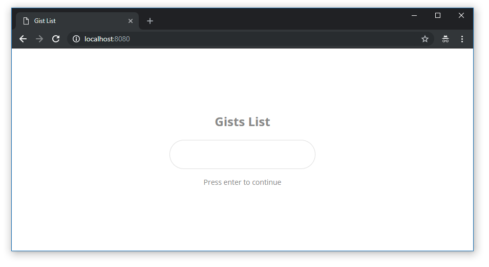

## Gist List

Gist List of a GitHub user.



## Install

Install with [yarn](https://yarnpkg.com):

```sh
$ yarn install
```

## Run

```sh
$ yarn start
```
Visit `http://localhost:8080/`

**Documentation Gist:**

* [Gist API](https://developer.github.com/v3/gists/)

## Features

* React 16
* Webpack 4
* Babel
* Hot Module Replacement
